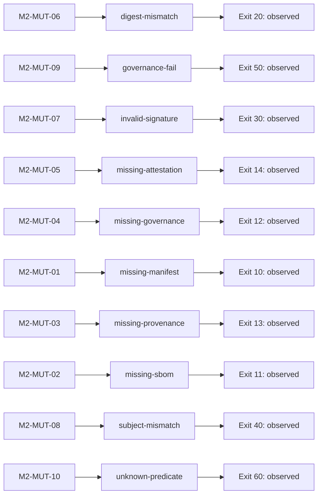

# Evidence Bundle v2.2 Crosswalk

<!-- Generated by scripts/crosswalk.py generate. Edit requirements.yaml, then regenerate. -->

## Status and authority

**Draft · validated scope: M2 · M2 Coverage: COMPLETE · Overall v2.2 Coverage: INCOMPLETE · Production Acceptance: NOT ESTABLISHED.**

`requirements.yaml` is the reviewed source for this local crosswalk, in the strict
JSON subset of YAML. It is not the missing canonical Evidence-v2.2 specification.
`M2-MUT-*` IDs retain the existing M2 contract; `GOV-*` and `TR-*` are provisional
planning IDs. Every canonical reference is unassigned. Schema and consistency
validation cannot establish the truth of a requirement or independent CI authenticity.

Governance remains a **Governance-Mock**; provenance remains **Demo-Provenance**.
HSM, Azure Key Vault and production trust anchors have not been validated.

## Requirement → evidence → attestation → verification → test → CI proof

The evidence locator identifies a referenced CAS object or signed predicate,
not an unsigned convenience export such as `sbom.json`.

| Requirement | Implementation / rule | Evidence / attestation predicate | Mutation | Exit | Coverage | CI proof |
|---|---|---|---|---:|---|---|
| **M2-MUT-01** Manifest Required | [_read_signed_artifact](../../demo-v2.2/sentinel_demo/verify.py) | request.manifest.artifact + payload — `https://sentinel.example/demo/evidence-manifest/v1` | [missing-manifest](../../demo-v2.2/tests/mutations/missing-manifest.yaml) | 10 | Covered (M2 only) | [Expected rejection observed](https://github.com/loesungerdechris-lang/upgraded-guacamole/actions/runs/35221177108/job/105201622011) |
| **M2-MUT-02** SBOM Required | [_read_signed_artifact](../../demo-v2.2/sentinel_demo/verify.py) | inventory.entries[role=sbom].payload — `https://cyclonedx.org/bom` | [missing-sbom](../../demo-v2.2/tests/mutations/missing-sbom.yaml) | 11 | Covered (M2 only) | [Expected rejection observed](https://github.com/loesungerdechris-lang/upgraded-guacamole/actions/runs/35221177108/job/105201622001) |
| **M2-MUT-03** Demo Provenance Required | [_read_signed_artifact](../../demo-v2.2/sentinel_demo/verify.py) | inventory.entries[role=provenance].payload — `https://sentinel.example/demo/provenance/v1` | [missing-provenance](../../demo-v2.2/tests/mutations/missing-provenance.yaml) | 13 | Covered (M2 only) | [Expected rejection observed](https://github.com/loesungerdechris-lang/upgraded-guacamole/actions/runs/35221177108/job/105201622030) |
| **M2-MUT-04** Governance Payload Required | [_read_signed_artifact](../../demo-v2.2/sentinel_demo/verify.py) | inventory.entries[role=governance].payload — `https://sentinel.example/demo/governance/v1` | [missing-governance](../../demo-v2.2/tests/mutations/missing-governance.yaml) | 12 | Covered (M2 only) | [Expected rejection observed](https://github.com/loesungerdechris-lang/upgraded-guacamole/actions/runs/35221177108/job/105201621985) |
| **M2-MUT-05** Attestation Wrapper Required | [_read_signed_artifact](../../demo-v2.2/sentinel_demo/verify.py) | inventory.entries[role=governance].artifact — `https://sentinel.example/demo/governance/v1` | [missing-attestation](../../demo-v2.2/tests/mutations/missing-attestation.yaml) | 14 | Covered (M2 only) | [Expected rejection observed](https://github.com/loesungerdechris-lang/upgraded-guacamole/actions/runs/35221177108/job/105201622213) |
| **M2-MUT-06** Digest Integrity | [_validate_content](../../demo-v2.2/sentinel_demo/verify.py) | OCI descriptors and actual CAS bytes — `https://cyclonedx.org/bom` | [digest-mismatch](../../demo-v2.2/tests/mutations/digest-mismatch.yaml) | 20 | Covered (M2 only) | [Expected rejection observed](https://github.com/loesungerdechris-lang/upgraded-guacamole/actions/runs/35221177108/job/105201622005) |
| **M2-MUT-07** Signature Validation | [_verify_and_extract_statement](../../demo-v2.2/sentinel_demo/verify.py) | root Sigstore bundle DSSE signature — `https://sentinel.example/demo/evidence-manifest/v1` | [invalid-signature](../../demo-v2.2/tests/mutations/invalid-signature.yaml) | 30 | Covered (M2 only) | [Expected rejection observed](https://github.com/loesungerdechris-lang/upgraded-guacamole/actions/runs/35221177108/job/105201622026) |
| **M2-MUT-08** Subject Binding | [_verify_and_extract_statement](../../demo-v2.2/sentinel_demo/verify.py) | signed statement subject.digest.sha256 — `https://sentinel.example/demo/governance/v1` | [subject-mismatch](../../demo-v2.2/tests/mutations/subject-mismatch.yaml) | 40 | Covered (M2 only) | [Expected rejection observed](https://github.com/loesungerdechris-lang/upgraded-guacamole/actions/runs/35221177108/job/105201622230) |
| **M2-MUT-09** Failed Mock Control Rejected | [_validate_governance](../../demo-v2.2/sentinel_demo/verify.py) | predicate.checks.buildPassed=false — `https://sentinel.example/demo/governance/v1` | [governance-fail](../../demo-v2.2/tests/mutations/governance-fail.yaml) | 50 | Covered (M2 only) | [Expected rejection observed](https://github.com/loesungerdechris-lang/upgraded-guacamole/actions/runs/35221177108/job/105201622057) |
| **M2-MUT-10** Unexpected Predicate Rejected | [_verify_and_extract_statement](../../demo-v2.2/sentinel_demo/verify.py) | signed statement predicateType vs expected role type — `https://sentinel.example/demo/governance/v1` | [unknown-predicate](../../demo-v2.2/tests/mutations/unknown-predicate.yaml) | 60 | Covered (M2 only) | [Expected rejection observed](https://github.com/loesungerdechris-lang/upgraded-guacamole/actions/runs/35221177108/job/105201622014) |

## Mutation → requirement (reverse mapping)

| Mutation | Requirement | Symbolic code |
|---|---|---|
| digest-mismatch | M2-MUT-06 | `DIGEST_MISMATCH` |
| governance-fail | M2-MUT-09 | `POLICY_VIOLATION` |
| invalid-signature | M2-MUT-07 | `INVALID_SIGNATURE` |
| missing-attestation | M2-MUT-05 | `MISSING_ATTESTATION` |
| missing-governance | M2-MUT-04 | `MISSING_GOVERNANCE` |
| missing-manifest | M2-MUT-01 | `MISSING_MANIFEST` |
| missing-provenance | M2-MUT-03 | `MISSING_PROVENANCE` |
| missing-sbom | M2-MUT-02 | `MISSING_SBOM` |
| subject-mismatch | M2-MUT-08 | `SUBJECT_MISMATCH` |
| unknown-predicate | M2-MUT-10 | `UNKNOWN_PREDICATE` |

## Future crosswalk items — excluded from the M2 denominator

| Provisional ID | Requirement | Milestone | Coverage | Limitation / related evidence |
|---|---|---|---|---|
| GOV-001 | Production Governance Evaluation | M3 | partial | Only the mock predicate and rejection of a false technical check are demonstrated; no production evaluation engine. Related demo test: governance-fail. |
| GOV-010 | Policy Evaluation Engine | M3 | open | Rule language, policy inputs and deterministic decision semantics require review. Related demo test: none. |
| GOV-011 | Risk Score Calculation | M3 | open | Candidate requirement; no scoring model or use of a score as an approval is accepted. Related demo test: none. |
| GOV-012 | CAB Approval Validation | M3 | open | Human approval identity, scope, validity and evidence must be specified; no synthetic approval. Related demo test: none. |
| TR-001 | PKCS#11 Trust Anchor | M4 | open | No HSM-backed signing validation or independently provisioned trust anchor. Related demo test: none. |
| TR-002 | Azure Key Vault Trust Anchor | M4 | open | No Azure Key Vault signing validation or independently provisioned trust anchor. Related demo test: none. |

## Calculated coverage

Local inventory: **16** requirements; covered **10**, partial **1**, open **5**.

M2: **10/10** requirements mapped and observed. Full v2.2: **INCOMPLETE; canonical denominator unknown**. No fabricated 24-requirement count or production coverage percentage.

Baseline [run 35221177108](https://github.com/loesungerdechris-lang/upgraded-guacamole/actions/runs/35221177108), commit `66732c7bfddd7812222827763336c732cf05461a`: **32 tests**, **12 successful jobs**, **10 expected rejections**, Golden PASS. Current CI results are separate from this frozen baseline.

## Traceability diagram

[Mermaid source](crosswalk.mmd). The diagram is a view, not independent evidence.

## Review and evidence boundaries

- [M2 baseline](../acceptance/m2-baseline.md) identifies the tested commit and artifact digests.
- [M2 mutation contract](../mutation-coverage-matrix.md) defines the exact rejection scope.
- [M3 Governance Realization plan](m3-governance-realization.md) is planning, not implementation.
- [CI and merge enforcement](review-and-gates.md) distinguishes a green check from server-side protection.
- The offline validator checks a reviewed GitHub observation and pinned source files; it does not contact GitHub or verify an independently signed CI receipt.
- A coordinated edit of all contracts and the validator can change the rules; independent review and server-side protection remain necessary.
