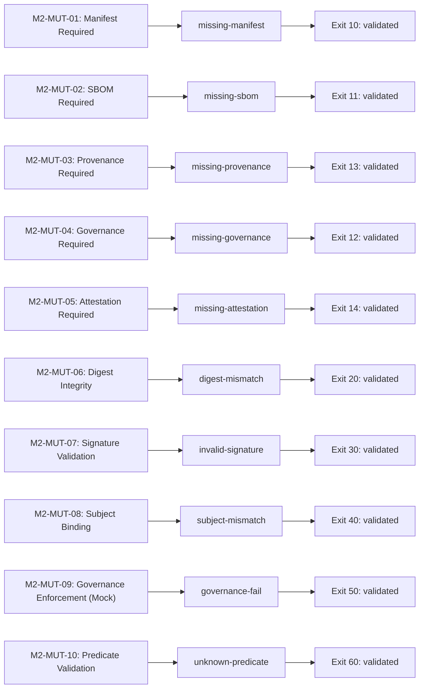

# Mutation Coverage Matrix

**Artefakt:** `SENTINEL-M2-MUTATION-COVERAGE` · Revision 1.0 · **DRAFT in PR #70**

**Geltung:** ausschließlich `sentinel-demo-m2/v0.1` · Architecture Demonstrator.

## Zweck und Vertragsstatus

Dieser M2-Abnahmevertrag definiert, welche zehn Fehlerklassen `verify-bundle`
in den beschriebenen Einzelfehler-Szenarien erkennen MUSS, wie die Defekte erzeugt
werden und welchen Prozess-Exit-Code der Verifizierer liefern MUSS. Die IDs
`M2-MUT-01` bis `M2-MUT-10` sind lokale M2-Anforderungen. Sie sind noch keine IDs
oder vollständige Zuordnung der kanonischen Evidence-v2.2-Spezifikation.

Grundlage ist ein einmal live erzeugtes und erfolgreich verifiziertes Golden
Bundle. Jede Mutation MUSS auf einer unabhängigen Kopie erfolgen. Der Golden-Index
und alle darin erfassten Dateien MÜSSEN vor und nach dem Lauf unverändert sein;
Golden MUSS vor und nach der Suite mit Exit 0 verifiziert werden.

Normativ sind die Erwartungen und Regeln dieses Dokuments zusammen mit dem
[M2-Profil](../demo-v2.2/docs/M2_PROFILE.md). Die Spalten „Observed“ und „Status“
sowie das Diagramm dokumentieren ausschließlich den unten identifizierten Lauf.
Sie sind kein automatisch aktualisierter CI-Status. Änderungen an Requirement,
Mutation oder Exit-Code erfordern eine gemeinsame Prüfung von Vertrag,
[Szenariokatalog](../demo-v2.2/tests/mutations), Verifier und nachgewiesenem Lauf.
Ein Widerspruch zwischen diesen Artefakten lässt die betroffene Abnahme offen.

## Coverage Summary — in 30 Sekunden

| Kennzahl | Nachgewiesener Stand |
|---|---|
| Requirements Covered | **10/10 der hier definierten M2-Anforderungen** |
| Mutation Scenarios | **10** |
| Expected Failures | **10 erwartete Bundle-Ablehnungen** |
| Observed Failures | **10 Ablehnungen mit exakt erwartetem Prozesscode** |
| Mutation Test Results | **10/10 PASS** — die Ablehnung ist das erwartete Testergebnis |
| Golden Control | **PASS, Exit 0** — separat, nicht als elfte Mutation gezählt |
| Implementation / Regression Tests | **32/32 bestanden** |
| CI Jobs | **12/12 erfolgreich** — Golden, zehn Mutationen, Gesamtgate |
| Coverage Status | **COMPLETE (M2 Scope)** |

„COMPLETE“ bedeutet, dass jede dieser zehn Anforderungen durch ihre angegebene
Mutation im Nachweislauf bestätigt wurde. Es bedeutet weder vollständige
Fehlerkombinations- oder Code-Coverage noch prozentuale Angriffsabdeckung,
Produktionsreife, Governance-Compliance oder vollständige v2.2-Konformität.

## 1. Technische Testfall-Matrix

„Expected Exit“ ist der vertragliche Prozesscode; „Observed“ stammt aus dem
verlinkten GitHub-Job. Die Mutation-Suite selbst ist nur erfolgreich, wenn diese
Codes exakt übereinstimmen. Reason-Codes und Logtexte dienen der Diagnose.

| Scenario | Mutation | Expected Exit | Observed | Covered Requirement | Status / Nachweis |
|---|---|---:|---:|---|---|
| `golden` (Happy Path) | Keine Mutation; Kontrollprüfung vor/nach der Suite. | 0 | 0 | Gültiges Bundle; Vorbedingung aller M2-MUT-Anforderungen | [✅ PASS](https://github.com/loesungerdechris-lang/upgraded-guacamole/actions/runs/35219131191/job/105194663202) |
| `missing-manifest` | Root-OCI-Manifest der Evidence-Attestation entfernen. | 10 | 10 | M2-MUT-01 | [✅ erwartete Ablehnung](https://github.com/loesungerdechris-lang/upgraded-guacamole/actions/runs/35219131191/job/105194817286) |
| `missing-sbom` | Referenzierten, signierten SBOM-Payload aus dem CAS entfernen. | 11 | 11 | M2-MUT-02 | [✅ erwartete Ablehnung](https://github.com/loesungerdechris-lang/upgraded-guacamole/actions/runs/35219131191/job/105194817346) |
| `missing-provenance` | Referenzierten Demo-Provenance-Payload aus dem CAS entfernen. | 13 | 13 | M2-MUT-03 | [✅ erwartete Ablehnung](https://github.com/loesungerdechris-lang/upgraded-guacamole/actions/runs/35219131191/job/105194817375) |
| `missing-governance` | Referenzierten Governance-Payload aus dem CAS entfernen. | 12 | 12 | M2-MUT-04 | [✅ erwartete Ablehnung](https://github.com/loesungerdechris-lang/upgraded-guacamole/actions/runs/35219131191/job/105194817344) |
| `missing-attestation` | Referenziertes Governance-OCI-Artefaktmanifest entfernen; Payload bleibt vorhanden. | 14 | 14 | M2-MUT-05 | [✅ erwartete Ablehnung](https://github.com/loesungerdechris-lang/upgraded-guacamole/actions/runs/35219131191/job/105194817288) |
| `digest-mismatch` | SBOM-Bundle-Bytes unter ihrer bisherigen Content-Adresse verändern; Descriptors bleiben unverändert. | 20 | 20 | M2-MUT-06 | [✅ erwartete Ablehnung](https://github.com/loesungerdechris-lang/upgraded-guacamole/actions/runs/35219131191/job/105194817334) |
| `invalid-signature` | Byte der Root-DSSE-Signatur kippen; äußere Descriptors und Prüfauftrag neu pinnen. | 30 | 30 | M2-MUT-07 | [✅ erwartete Ablehnung](https://github.com/loesungerdechris-lang/upgraded-guacamole/actions/runs/35219131191/job/105194817499) |
| `subject-mismatch` | Gültig signierte Governance für andere Image-Bytes einsetzen; Inventory gültig neu signieren. | 40 | 40 | M2-MUT-08 | [✅ erwartete Ablehnung](https://github.com/loesungerdechris-lang/upgraded-guacamole/actions/runs/35219131191/job/105194817372) |
| `governance-fail` | Gültig signiertes Governance-Predicate mit buildPassed:false einsetzen; Inventory gültig neu signieren. | 50 | 50 | M2-MUT-09 | [✅ erwartete Ablehnung](https://github.com/loesungerdechris-lang/upgraded-guacamole/actions/runs/35219131191/job/105194817321) |
| `unknown-predicate` | Für die Governance-Rolle gültig signierten unbekannten Predicate-URI einsetzen; Inventory gültig neu signieren. | 60 | 60 | M2-MUT-10 | [✅ erwartete Ablehnung](https://github.com/loesungerdechris-lang/upgraded-guacamole/actions/runs/35219131191/job/105194817376) |

Der Happy Path ist der separate `verify-golden`-Job und die Kontrollprüfung des
Suite-Runners; es gibt keinen deklarativen Katalogeintrag `happy` oder `golden`.
Bei Presence-Fällen unterscheidet das Profil OCI-Artefaktmanifest und signierten
Payload. Das Entfernen einer lesbaren Exportkopie wie `sbom.json` würde den
signierten Nachweis im CAS (Content-Addressed Store) nicht entfernen.

Subject-, Governance- und Predicate-Fälle verwenden bereits bei der Golden-
Erzeugung vorbereitete, öffentlich exportierte und gültig signierte Änderungen.
Die betroffenen Inventories sind ebenfalls gültig signiert. Dadurch erreicht
der Test die beabsichtigte semantische Prüfung. Nur der Signaturfall beschädigt
absichtlich eine Signatur; äußere Hashes werden dort angepasst, damit tatsächlich
die Signaturprüfung entscheidet. Die Mutationsjobs erhalten keinen privaten Schlüssel.

## 2. Requirement-Coverage und Traceability

Alle Aussagen beziehen sich auf die konkret definierte Mutation, nicht auf
sämtliche denkbaren Verletzungen derselben Fehlerklasse.

| Requirement ID | Covered Requirement / normative Aussage | Covered By / Deklaration | Diagnostic Reason |
|---|---|---|---|
| M2-MUT-01 | **Manifest Required:** Die referenzierte Evidence-Manifest-Attestation MUSS vorhanden sein. | [`missing-manifest`](../demo-v2.2/tests/mutations/missing-manifest.yaml) | `MISSING_MANIFEST` |
| M2-MUT-02 | **SBOM Required:** Der referenzierte SBOM-Payload MUSS vorhanden sein. | [`missing-sbom`](../demo-v2.2/tests/mutations/missing-sbom.yaml) | `MISSING_SBOM` |
| M2-MUT-03 | **Provenance Required:** Der referenzierte Demo-Provenance-Payload MUSS vorhanden sein. | [`missing-provenance`](../demo-v2.2/tests/mutations/missing-provenance.yaml) | `MISSING_PROVENANCE` |
| M2-MUT-04 | **Governance Required:** Der referenzierte Governance-Payload MUSS vorhanden sein. | [`missing-governance`](../demo-v2.2/tests/mutations/missing-governance.yaml) | `MISSING_GOVERNANCE` |
| M2-MUT-05 | **Attestation Required:** Der im Inventory referenzierte OCI-Attestation-Wrapper MUSS vorhanden sein. | [`missing-attestation`](../demo-v2.2/tests/mutations/missing-attestation.yaml) | `MISSING_ATTESTATION` |
| M2-MUT-06 | **Digest Integrity:** Geänderte Payload-Bytes unter dem erwarteten Digest MÜSSEN abgelehnt werden. | [`digest-mismatch`](../demo-v2.2/tests/mutations/digest-mismatch.yaml) | `DIGEST_MISMATCH` |
| M2-MUT-07 | **Signature Validation:** Die beschädigte DSSE-Signatur MUSS trotz konsistenter äußerer Hashes abgelehnt werden. | [`invalid-signature`](../demo-v2.2/tests/mutations/invalid-signature.yaml) | `INVALID_SIGNATURE` |
| M2-MUT-08 | **Subject Binding:** Ein gültig signierter, abweichender Image-Subject MUSS abgelehnt werden. | [`subject-mismatch`](../demo-v2.2/tests/mutations/subject-mismatch.yaml) | `SUBJECT_MISMATCH` |
| M2-MUT-09 | **Governance Enforcement (Mock):** Ein formal gültiger Mock-Report mit fehlgeschlagenem technischem Check MUSS abgelehnt werden. | [`governance-fail`](../demo-v2.2/tests/mutations/governance-fail.yaml) | `POLICY_VIOLATION` |
| M2-MUT-10 | **Predicate Validation:** Ein gültig signierter, für die Rolle unerwarteter Predicate-Typ MUSS abgelehnt werden. | [`unknown-predicate`](../demo-v2.2/tests/mutations/unknown-predicate.yaml) | `UNKNOWN_PREDICATE` |

Die ausführbare Umsetzung ist in
[`mutations.py`](../demo-v2.2/sentinel_demo/mutations.py),
[`golden_variants.py`](../demo-v2.2/scripts/golden_variants.py),
[`verify.py`](../demo-v2.2/sentinel_demo/verify.py) und
[`run_mutation_suite.py`](../demo-v2.2/scripts/run_mutation_suite.py) nachvollziehbar.
Die [Workflow-Abhängigkeiten](../.github/workflows/sentinel-demo.yml) verbinden
Golden, Matrix und Gesamtgate.

**v2.2-Crosswalk: OFFEN.** Der kanonische Requirement-Katalog und seine 24 Fälle
werden hier nicht als vollständig zugeordnet oder abgenommen ausgewiesen.
Die M2-IDs bilden dafür explizite Anknüpfungspunkte; eine spätere Zuordnung muss
mit Version und Fundstelle des kanonischen Vertrags ergänzt und geprüft werden.

## 3. Heatmap / Status-Matrix

Legende: ✅ im referenzierten Lauf validiert · ⬜ außerhalb der validierten M2-Abnahme.
Die Textangaben bleiben maßgeblich; Farbe oder Symbol allein trägt keine Aussage.

| Kategorie | Anforderungen / Status | M2-Nachweis |
|---|---|---:|
| Evidence Presence | ✅ Manifest · ✅ SBOM · ✅ Demo-Provenance · ✅ Governance · ✅ Attestation-Wrapper | 5/5 |
| Integrity and Binding | ✅ Digest · ✅ Signatur · ✅ Subject Binding | 3/3 |
| Demo Policy and Predicate | ✅ fehlgeschlagener Mock-Control · ✅ unerwarteter Predicate-Typ | 2/2 |
| Production Governance / Trust | ⬜ echte Governance-Evaluation · ⬜ HSM · ⬜ Azure Key Vault · ⬜ Produktions-Vertrauensanker | Nicht validiert |

## 4. Mermaid-Sicht: Requirement → Mutation → beobachtete Ablehnung

Die [Mermaid-Quelldatei](mutation-coverage.mmd) entspricht dem folgenden Block.
Das Diagramm ist eine Darstellung der nachgewiesenen Zuordnung; der Nachweis
besteht aus Commit, Prüflauf und Ergebnissen. GitHub rendert den eingebetteten
`mermaid`-Block in Markdown; die `.mmd`-Datei dient als versionierte Quelle.
Siehe [GitHub-Dokumentation](https://docs.github.com/en/get-started/writing-on-github/working-with-advanced-formatting/creating-diagrams).

## Abnahmeregeln und Fehlerabgrenzung

1. Golden-Erzeugung und vollständige Golden-Verifikation MÜSSEN erfolgreich sein,
   bevor Mutationen als M2-Nachweis zählen dürfen.
2. Jede Mutation MUSS nur die benannte Fehlerbedingung wirksam einbringen;
   erforderliche Signaturen und Hashbindungen für nachgelagerte semantische
   Prüfungen MÜSSEN gültig bleiben.
3. Die Suite MUSS den tatsächlichen Exit-Code des Verifier-Prozesses gegen den
   unabhängig deklarierten Erwartungswert prüfen. „Irgendein Fehler“ genügt nicht.
4. Fehler bei Vorbereitung, Werkzeugaufruf oder Ergebnisablage DÜRFEN NICHT als
   erwartete Bundle-Ablehnung gewertet werden. M2-Verifikationsfehler außerhalb
   der Tabelle liefern 90; Mutator-Fehler 99. CLI-Eingabe-/Syntaxfehler vor dem
   M2-Profil werden im [Profilvertrag](../demo-v2.2/docs/M2_PROFILE.md) abgegrenzt.
5. Wiederholte Mutation desselben Golden-Bundles MUSS identische Arbeitskopien
   erzeugen. Golden MUSS bytegleich bleiben und anschließend weiter PASS liefern.
6. Das CI-Gate DARF nur öffnen, wenn `verify-golden` und die vollständige
   `mutation-suite` jeweils `success` melden. Fehlgeschlagen, abgebrochen,
   übersprungen oder unbekannt erfüllt den Vertrag nicht.

## Nachweisstand

- Nachweislauf: [GitHub Actions 35219131191](https://github.com/loesungerdechris-lang/upgraded-guacamole/actions/runs/35219131191), abgeschlossen am **17.09.2026 (UTC)**.
- Geprüfter PR-Head: [`d475430124d7ed8fd8b01402dc518c71ed29a6af`](https://github.com/loesungerdechris-lang/upgraded-guacamole/commit/d475430124d7ed8fd8b01402dc518c71ed29a6af).
- Geprüfter Source-Tree: `428139a70dab3bef54517f0ba41ddf1248296121`.
- Golden-Index-Pin: `sha256:58c9aabc033370c4c246b5838e860d75a5fa18d76e7d635b08fcbf835e85e3a8`.
- [Golden-Job](https://github.com/loesungerdechris-lang/upgraded-guacamole/actions/runs/35219131191/job/105194663202): 32 Tests bestanden, Registry-Rundlauf und Golden PASS.
- [Gesamtgate](https://github.com/loesungerdechris-lang/upgraded-guacamole/actions/runs/35219131191/job/105194885213): PASS; alle zehn Szenarien lieferten die oben genannten Codes.
- 13 öffentliche Workflow-Artefakte: Golden, separater Pin, zehn Szenarioberichte und Gate-Bericht; Aufbewahrung bis **24.09.2026**. Ein dauerhaftes Auditarchiv ist damit nicht eingerichtet.

Dieser Vertrag dokumentiert den Nachweis für genau diesen Stand. Spätere Commits
übernehmen dessen Status nicht automatisch. Aktuelle Folgeläufe werden in
[PR #70](https://github.com/loesungerdechris-lang/upgraded-guacamole/pull/70) getrennt ausgewiesen.

## Limitations / Reifegrad

| Bereich | Status |
|---|---|
| Governance Predicate | **Mock**; `fixture:true`, `productionApproval:false` |
| Provenance | **Demo Provenance**; kein SLSA-Provenance-/Level-Nachweis |
| Validiert | Evidence-Struktur im engen M2-Profil, Digest-Prüfung, Software-Key-Signaturen, Subject Binding, Exit-Code-Vertrag |
| Nicht validiert | Production Governance Evaluation; HSM-backed Signing / PKCS#11; Azure Key Vault Signing; Production Trust Anchors |
| Ebenfalls offen | unabhängige Release-Autorisierung, Zeit-/Widerrufsprüfung, vollständiger kanonischer v2.2-Crosswalk und Abnahmekatalog |
| Freigabe | Architecture Demonstrator, Draft; `productionAcceptance:false`; menschliches Review bleibt erforderlich |

Die Mutationen prüfen exportierte OCI-Evidenz offline. Der Golden-Lauf validiert
den lokalen Registry-Rundlauf; Löschsemantik fremder Registries, GHCR-Interoperabilität
und beliebige Kombinationen mehrerer Defekte sind hier nicht abgenommen.
Ein selbst erzeugter Testschlüssel ist kein unabhängiger Produktions-Vertrauensanker.
